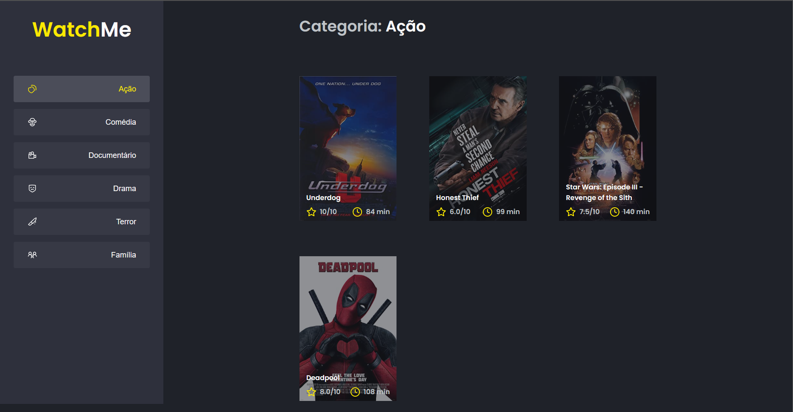
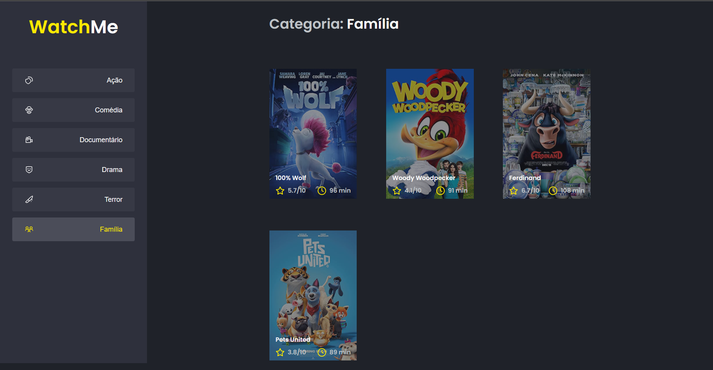

<h1 align="center">Desafio Ignite</h1>

<!-- Getting Started -->
# Sobre a aplicação
Aplicação desenvolvida no treinamento Ignite da Rocketseat, para aplimorar os conhecimentos de estado e componentização no react e consumo de API.

### INICIANDO O PROJETO

Para instalar o projeto em sua maquina siga os passos abaixo.

### INSTALAÇÃO

1. Clone o repositório

   ```sh
   git clone https://github.com/NiloMarcos/ignite-second-project.git
   ```

2. Entre na pasta

   ```sh
   cd ignite-second-project
   ```

3. Instale as dependências

   ```sh
   yarn
   ```

   ou

   ```sh
   npm i

### Iniciar a aplicação
1. Abra um terminal e rode o servidor primeiro
   ```sh
   yarn server
   ```

2. Abra um segundo terminal e rode a aplicação simultâneo com o server
   ```sh
   yarn dev
   ```


### Apresentação da aplicação

<p align="center">

<div>
  
 
  
</div>